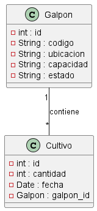

# Ejemplo

# Control y seguimiento Distribuciones Avícola. 

#### Necesidad:  Se tiene una granja de cultivo de pollos y se requiere desarrollar un sistema que permita controlar el tiempo de cada galpón. Para ello, se debe registrar para cada galpón el `código`, el `número de ubicación` y la `capacidad de pollos` que puede albergar. Además, se debe tener en cuenta el estado de ocupación del galpón, el cual puede estar `marcado como "usado" o "vacío".` Cuando lleguen nuevos pollos, se deberá ingresar la `cantidad`, la `fecha` y actualizar el `estado` del galpón según corresponda.

#### Análisis: Definición de requerimientos.

### Requerimientos Funcionales (RF)

**RF1: Gestión de galpones**

* **RF1.1:** Registrar galpones.
    * **Entrada:** `código`, `ubicación`, `capacidad`.
    * **Salida:** Galpón registrado.
    * **Restricciones:**
        * El código del galpón debe ser único.
        * La capacidad del galpón debe ser un valor numérico positivo.
* **RF1.2:** Consultar galpones.
    * **Entrada:** `(Opcional) código`, `(Opcional) ubicación`, `(Opcional) estado`.
    * **Salida:** Lista de galpones con su información.
* **RF1.3:** Modificar galpones.
    * **Entrada:** `código`, `(Opcional) ubicación`, `(Opcional) capacidad`, `(Opcional) estado`.
    * **Salida:** Galpón modificado.
    * **Restricciones:**
        * El código del galpón debe existir en la base de datos.
* **RF1.4:** Eliminar galpones.
    * **Entrada:** `código`.
    * **Salida:** Galpón eliminado.
    * **Restricciones:**
        * El galpón no debe tener cultivos asociados.

**RF2: Gestión de cultivos**

* **RF2.1:** Registrar un nuevo cultivo.
    * Entrada: `galpón_id`, `cantidad`, `fecha`.
    * **Salida:** Cultivo registrado.
    * **Restricciones:**
        * El galpón_id debe corresponder a un galpón existente y disponible.
        * La cantidad debe ser un valor numérico positivo.
        * La fecha debe ser posterior a la fecha actual.
* **RF2.2:** Consultar cultivos.
    * **Entrada:** `(Opcional) galpón_id`, `(Opcional) fecha_inicio`, `(Opcional) fecha_fin`.
    * **Salida:** Lista de cultivos con su información.
* **RF2.3:** Modificar cultivos.
    * **Entrada:** `cultivo_id`, `(Opcional) galpón_id`, `(Opcional) cantidad`, `(Opcional) fecha`.
    * **Salida:** Cultivo modificado.
    * **Restricciones:**
        * El cultivo_id debe corresponder a un cultivo existente.
        * Si se modifica el galpón_id, el nuevo galpón debe estar disponible.
        * La cantidad debe ser un valor numérico positivo.
        * La fecha no puede ser anterior a la fecha de inicio del cultivo.
* **RF2.4:** Eliminar cultivos.
    * **Entrada:** `cultivo_id`.
    * **Salida:** Cultivo eliminado.

**RF3: Obtener el estado de ocupación de un galpón**

* **RF3.1:** Consultar estado de ocupación de un galpón.
    * **Entrada:** `galpón_id`.
    * **Salida:** Indica si el galpón está ocupado o disponible.

**RF4: Generar reportes**

* **RF4.1:** Generar reporte de cultivos por galpón.
    * **Entrada:** `galpón_id`.
    * **Salida:** Reporte con la información de los cultivos de un galpón (fecha, cantidad, estado).
* **RF4.2:** Generar reporte de galpones con cultivos activos.
    * **Entrada:** `(Opcional) fecha_inicio`, `(Opcional) fecha_fin`.
    * **Salida:** Reporte con la información de los galpones que tienen cultivos activos en un rango de fechas (código, ubicación, capacidad, estado, cultivos asociados).

### Requerimientos No Funcionales (RNF)

**RNF1: Seguridad**

* **RNF1.1:** Implementar un sistema de autenticación y autorización para el acceso a la aplicación.
* **RNF1.2:** Proteger los datos de los usuarios y los cultivos mediante mecanismos de cifrado y control de acceso.
* **RNF1.3:** Implementar un registro de auditoría para rastrear las acciones de los usuarios en la aplicación.

**RNF2: Desempeño**

* **RNF2.1:** La aplicación debe ser capaz de manejar un gran volumen de datos y usuarios sin comprometer el rendimiento.
* **RNF2.2:** Las operaciones de la aplicación deben ser rápidas y eficientes.

**RNF3: Usabilidad**

#### Diseñar Base de Datos
Datos a tener en cuenta

| código | Ubicación | Capacidad | Cantidad |  Fecha   | Estado |
|--------|-----------|-----------|----------|----------|--------|
| 101    |C-101      |2500       |0         |          | False  |
| 102    |C-102      |2400       |2000      |17-04-2024| True   |
| 112    |B-112      |600        |600       |17-04-2024| False  |
| 112    |B-112      |600        |400       |20-05-2024| True   |

* De lo anterior, se puede resaltar lo siguiente, si bien es cierto, se puede ingresar los datos sin normalización, se sabe que es necesario para la optimización y traza de los datos. 

En este sentido, se procede a normarlizar de la siguiente manera. 

* La clasificación de los galpones, estos son individuales. 

`galpon`
| id |código | Ubicación | Capacidad |Estado     |
|----|-------|-----------|-----------|-----------|
|  1 |101    |C-101      |2500       |True       |
|  2 |102    |C-102      |2400       |True       |
|  3 |112    |B-112      |600        |False      |
|  4 |112    |A-112      |1600       |False      |

* Se conoce que inicio de un cultivo, se requiere de la disponibilidad del galpon. Al Asignar un grupo de pollos al galpon, se debe `ocupar` el galpo  

`Cultivo`
| id    | Cantidad |  Fecha     | GalponId | 
|-------|----------|------------|----------|
|   1   | 1200     | 17-04-2024 |   4      |
|   2   | 600      | 17-04-2024 |   3      |
|   3   | 400      | 20-5-2024  |   3      |


> Ver

        
> Script de la base de datos
```sql
    DROP DATABASE IF EXISTS cultivo;

    CREATE DATABASE cultivo;

    USE cultivo;

    CREATE table galpon(
        id INT NOT NULL PRIMARY KEY AUTO_INCREMENT,
        codigo VARCHAR(50) NOT NULL UNIQUE,
        ubicacion VARCHAR(50) NOT NULL,
        capacidad INT NOT NULL,
        estado BIT DEFAULT TRUE
    ); 

    CREATE table cultivo(
        id INT NOT NULL PRIMARY KEY AUTO_INCREMENT,
        cantidad VARCHAR(50) NOT NULL,
        fecha DATE NOT NULL,
        galpon_id INT NOT NULL,
        FOREIGN KEY (galpon_id) REFERENCES galpon(id)
    ); 
```
# Ver planificación 
[Ver Aquí](https://trello.com/b/gOEix3Zs/control-y-seguimiento-distribuciones-avicola)


cambios principales de desarrollo
